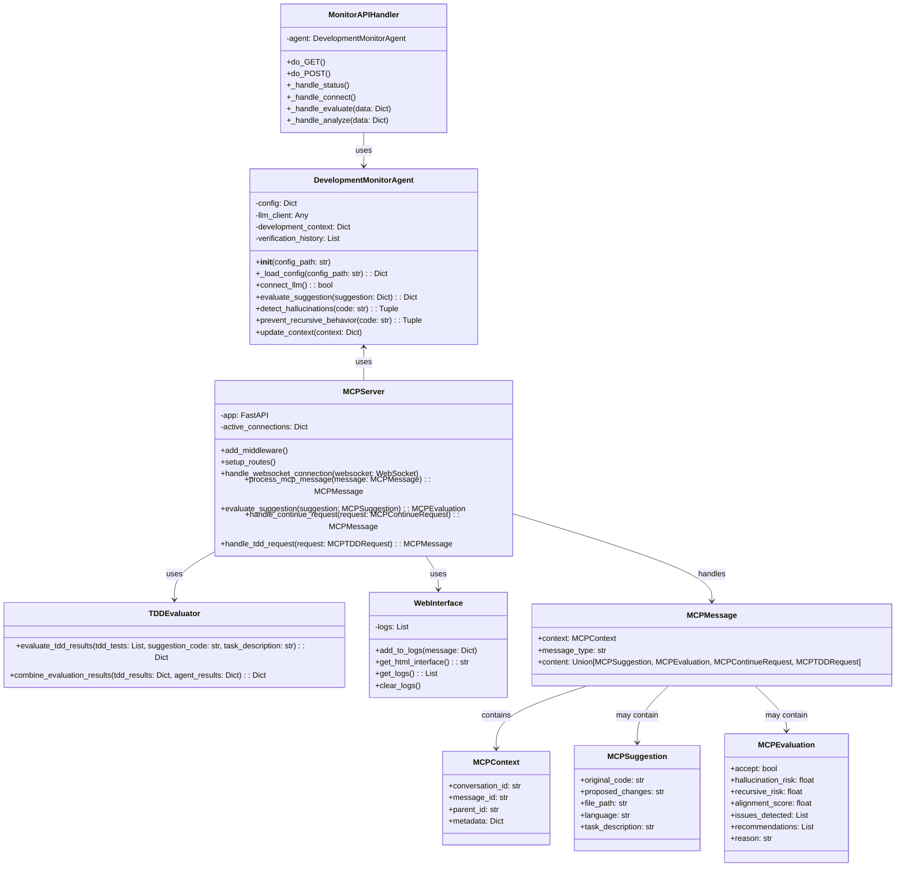

# Backend Components UML

```mermaid
classDiagram
    class DevelopmentMonitorAgent {
        -config: Dict
        -llm_client: Any
        -development_context: Dict
        -verification_history: List
        +__init__(config_path: str)
        +_load_config(config_path: str): Dict
        +connect_llm(): bool
        +evaluate_suggestion(suggestion: Dict): Dict
        +detect_hallucinations(code: str): Tuple
        +prevent_recursive_behavior(code: str): Tuple
        +update_context(context: Dict)
    }
    
    class MCPServer {
        -app: FastAPI
        -active_connections: Dict
        +add_middleware()
        +setup_routes()
        +handle_websocket_connection(websocket: WebSocket)
        +process_mcp_message(message: MCPMessage): MCPMessage
        +evaluate_suggestion(suggestion: MCPSuggestion): MCPEvaluation
        +handle_continue_request(request: MCPContinueRequest): MCPMessage
        +handle_tdd_request(request: MCPTDDRequest): MCPMessage
    }
    
    class MonitorAPIHandler {
        -agent: DevelopmentMonitorAgent
        +do_GET()
        +do_POST()
        +_handle_status()
        +_handle_connect()
        +_handle_evaluate(data: Dict)
        +_handle_analyze(data: Dict)
    }
    
    class TDDEvaluator {
        +evaluate_tdd_results(tdd_tests: List, suggestion_code: str, task_description: str): Dict
        +combine_evaluation_results(tdd_results: Dict, agent_results: Dict): Dict
    }
    
    class WebInterface {
        -logs: List
        +add_to_logs(message: Dict)
        +get_html_interface(): str
        +get_logs(): List
        +clear_logs()
    }
    
    class MCPContext {
        +conversation_id: str
        +message_id: str
        +parent_id: str
        +metadata: Dict
    }
    
    class MCPSuggestion {
        +original_code: str
        +proposed_changes: str
        +file_path: str
        +language: str
        +task_description: str
    }
    
    class MCPEvaluation {
        +accept: bool
        +hallucination_risk: float
        +recursive_risk: float
        +alignment_score: float
        +issues_detected: List
        +recommendations: List
        +reason: str
    }
    
    class MCPMessage {
        +context: MCPContext
        +message_type: str
        +content: Union[MCPSuggestion, MCPEvaluation, MCPContinueRequest, MCPTDDRequest]
    }
    
    DevelopmentMonitorAgent <-- MCPServer : uses
    MCPServer --> TDDEvaluator : uses
    MCPServer --> WebInterface : uses
    MonitorAPIHandler --> DevelopmentMonitorAgent : uses
    MCPServer --> MCPMessage : handles
    MCPMessage --> MCPContext : contains
    MCPMessage --> MCPSuggestion : may contain
    MCPMessage --> MCPEvaluation : may contain
```
