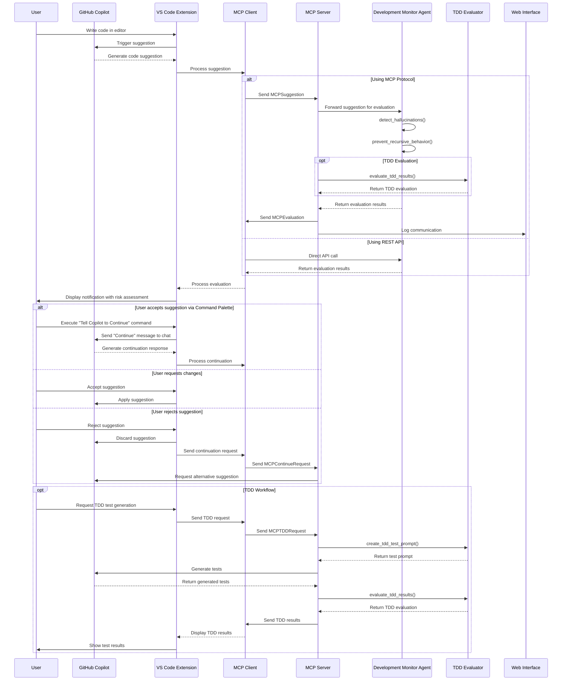

# Component Interaction UML (Sequence Diagram)

```mermaid
sequenceDiagram
    participant User
    participant GHCopilot as GitHub Copilot
    participant VSExt as VS Code Extension
    participant MCPClient as MCP Client
    participant MCPServer as MCP Server
    participant Agent as Development Monitor Agent
    participant TDD as TDD Evaluator
    participant Web as Web Interface
    
    User->>VSExt: Write code in editor
    VSExt->>GHCopilot: Trigger suggestion
    GHCopilot-->>VSExt: Generate code suggestion
    VSExt->>MCPClient: Process suggestion
    
    alt Using MCP Protocol
        MCPClient->>MCPServer: Send MCPSuggestion
        MCPServer->>Agent: Forward suggestion for evaluation
        Agent->>Agent: detect_hallucinations()
        Agent->>Agent: prevent_recursive_behavior()
        
        opt TDD Evaluation
            MCPServer->>TDD: evaluate_tdd_results()
            TDD-->>MCPServer: Return TDD evaluation
        end
        
        Agent-->>MCPServer: Return evaluation results
        MCPServer->>MCPClient: Send MCPEvaluation
        MCPServer->>Web: Log communication
    else Using REST API
        MCPClient->>Agent: Direct API call
        Agent-->>MCPClient: Return evaluation results
    end
    
    MCPClient-->>VSExt: Process evaluation
    VSExt->>User: Display notification with risk assessment
    
    alt User accepts suggestion via Command Palette
        User->>VSExt: Execute "Tell Copilot to Continue" command
        VSExt->>GHCopilot: Send "Continue" message to chat
        GHCopilot-->>VSExt: Generate continuation response
        VSExt->>MCPClient: Process continuation
    else User requests changes
        User->>VSExt: Accept suggestion
        VSExt->>GHCopilot: Apply suggestion
    else User rejects suggestion
        User->>VSExt: Reject suggestion
        VSExt->>GHCopilot: Discard suggestion
        VSExt->>MCPClient: Send continuation request
        MCPClient->>MCPServer: Send MCPContinueRequest
        MCPServer->>GHCopilot: Request alternative suggestion
    end
    
    opt TDD Workflow
        User->>VSExt: Request TDD test generation
        VSExt->>MCPClient: Send TDD request
        MCPClient->>MCPServer: Send MCPTDDRequest
        MCPServer->>TDD: create_tdd_test_prompt()
        TDD-->>MCPServer: Return test prompt
        MCPServer->>GHCopilot: Generate tests
        GHCopilot-->>MCPServer: Return generated tests
        MCPServer->>TDD: evaluate_tdd_results()
        TDD-->>MCPServer: Return TDD evaluation
        MCPServer->>MCPClient: Send TDD results
        MCPClient-->>VSExt: Display TDD results
        VSExt->>User: Show test results
    end
```
