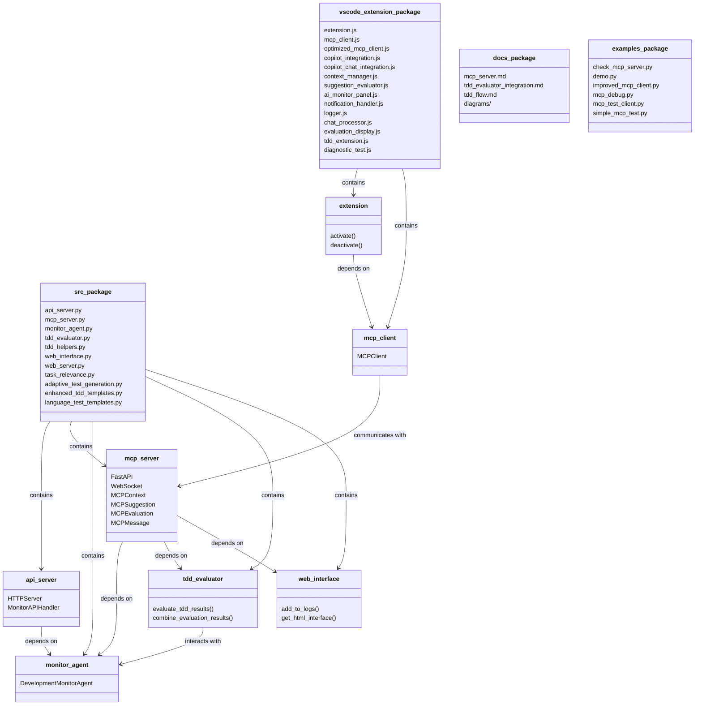

# Package/Module Dependency UML

```mermaid
classDiagram
    class src_package {
        api_server.py
        mcp_server.py
        monitor_agent.py
        tdd_evaluator.py
        tdd_helpers.py
        web_interface.py
        web_server.py
        task_relevance.py
        adaptive_test_generation.py
        enhanced_tdd_templates.py
        language_test_templates.py
    }
    
    class vscode_extension_package {
        extension.js
        mcp_client.js
        optimized_mcp_client.js
        copilot_integration.js
        copilot_chat_integration.js
        context_manager.js
        suggestion_evaluator.js
        ai_monitor_panel.js
        notification_handler.js
        logger.js
        chat_processor.js
        evaluation_display.js
        tdd_extension.js
        diagnostic_test.js
    }
    
    class docs_package {
        mcp_server.md
        tdd_evaluator_integration.md
        tdd_flow.md
        diagrams/
    }
    
    class examples_package {
        check_mcp_server.py
        demo.py
        improved_mcp_client.py
        mcp_debug.py
        mcp_test_client.py
        simple_mcp_test.py
    }
    
    class api_server {
        HTTPServer
        MonitorAPIHandler
    }
    
    class mcp_server {
        FastAPI
        WebSocket
        MCPContext
        MCPSuggestion
        MCPEvaluation
        MCPMessage
    }
    
    class monitor_agent {
        DevelopmentMonitorAgent
    }
    
    class tdd_evaluator {
        evaluate_tdd_results()
        combine_evaluation_results()
    }
    
    class web_interface {
        add_to_logs()
        get_html_interface()
    }
    
    class extension {
        activate()
        deactivate()
    }
    
    class mcp_client {
        MCPClient
    }

    src_package --> api_server : contains
    src_package --> mcp_server : contains
    src_package --> monitor_agent : contains
    src_package --> tdd_evaluator : contains
    src_package --> web_interface : contains
    
    vscode_extension_package --> extension : contains
    vscode_extension_package --> mcp_client : contains
    
    mcp_server --> monitor_agent : depends on
    mcp_server --> tdd_evaluator : depends on
    mcp_server --> web_interface : depends on
    api_server --> monitor_agent : depends on
    
    extension --> mcp_client : depends on
    mcp_client --> mcp_server : communicates with
    
    tdd_evaluator --> monitor_agent : interacts with
```
