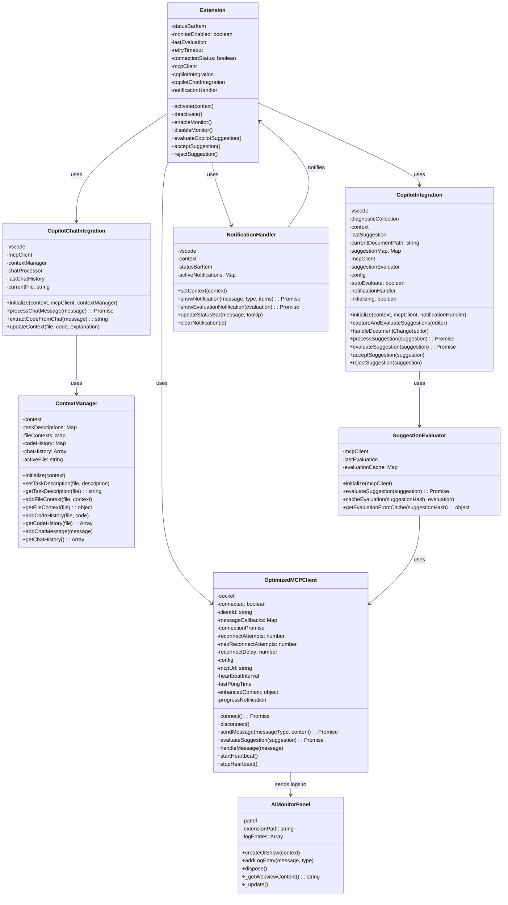

# VS Code Extension Components UML

```mermaid
classDiagram
    class Extension {
        -statusBarItem
        -monitorEnabled: boolean
        -lastEvaluation
        -retryTimeout
        -connectionStatus: boolean
        -mcpClient
        -copilotIntegration
        -copilotChatIntegration
        -notificationHandler
        +activate(context)
        +deactivate()
        +enableMonitor()
        +disableMonitor()
        +evaluateCopilotSuggestion()
        +acceptSuggestion()
        +rejectSuggestion()
    }
    
    class OptimizedMCPClient {
        -socket
        -connected: boolean
        -clientId: string
        -messageCallbacks: Map
        -connectionPromise
        -reconnectAttempts: number
        -maxReconnectAttempts: number
        -reconnectDelay: number
        -config
        -mcpUrl: string
        -heartbeatInterval
        -lastPongTime
        -enhancedContext: object
        -progressNotification
        +connect(): Promise
        +disconnect()
        +sendMessage(messageType, content): Promise
        +evaluateSuggestion(suggestion): Promise
        +handleMessage(message)
        +startHeartbeat()
        +stopHeartbeat()
    }
    
    class CopilotIntegration {
        -vscode
        -diagnosticCollection
        -context
        -lastSuggestion
        -currentDocumentPath: string
        -suggestionMap: Map
        -mcpClient
        -suggestionEvaluator
        -config
        -autoEvaluate: boolean
        -notificationHandler
        -initializing: boolean
        +initialize(context, mcpClient, notificationHandler)
        +captureAndEvaluateSuggestions(editor)
        +handleDocumentChange(editor)
        +processSuggestion(suggestion): Promise
        +evaluateSuggestion(suggestion): Promise
        +acceptSuggestion(suggestion)
        +rejectSuggestion(suggestion)
    }
    
    class CopilotChatIntegration {
        -vscode
        -mcpClient
        -contextManager
        -chatProcessor
        -lastChatHistory
        -currentFile: string
        +initialize(context, mcpClient, contextManager)
        +processChatMessage(message): Promise
        +extractCodeFromChat(message): string
        +updateContext(file, code, explanation)
    }
    
    class ContextManager {
        -context
        -taskDescriptions: Map
        -fileContexts: Map
        -codeHistory: Map
        -chatHistory: Array
        -activeFile: string
        +initialize(context)
        +setTaskDescription(file, description)
        +getTaskDescription(file): string
        +addFileContext(file, context)
        +getFileContext(file): object
        +addCodeHistory(file, code)
        +getCodeHistory(file): Array
        +addChatMessage(message)
        +getChatHistory(): Array
    }
    
    class SuggestionEvaluator {
        -mcpClient
        -lastEvaluation
        -evaluationCache: Map
        +initialize(mcpClient)
        +evaluateSuggestion(suggestion): Promise
        +cacheEvaluation(suggestionHash, evaluation)
        +getEvaluationFromCache(suggestionHash): object
    }
    
    class AIMonitorPanel {
        -panel
        -extensionPath: string
        -logEntries: Array
        +createOrShow(context)
        +addLogEntry(message, type)
        +dispose()
        +_getWebviewContent(): string
        +_update()
    }
    
    class NotificationHandler {
        -vscode
        -context
        -statusBarItem
        -activeNotifications: Map
        +setContext(context)
        +showNotification(message, type, items): Promise
        +showEvaluationNotification(evaluation): Promise
        +updateStatusBar(message, tooltip)
        +clearNotification(id)
    }
    
    Extension --> OptimizedMCPClient : uses
    Extension --> CopilotIntegration : uses
    Extension --> CopilotChatIntegration : uses
    Extension --> NotificationHandler : uses
    CopilotIntegration --> SuggestionEvaluator : uses
    CopilotChatIntegration --> ContextManager : uses
    OptimizedMCPClient --> AIMonitorPanel : sends logs to
    SuggestionEvaluator --> OptimizedMCPClient : uses
    NotificationHandler --> Extension : notifies
```
