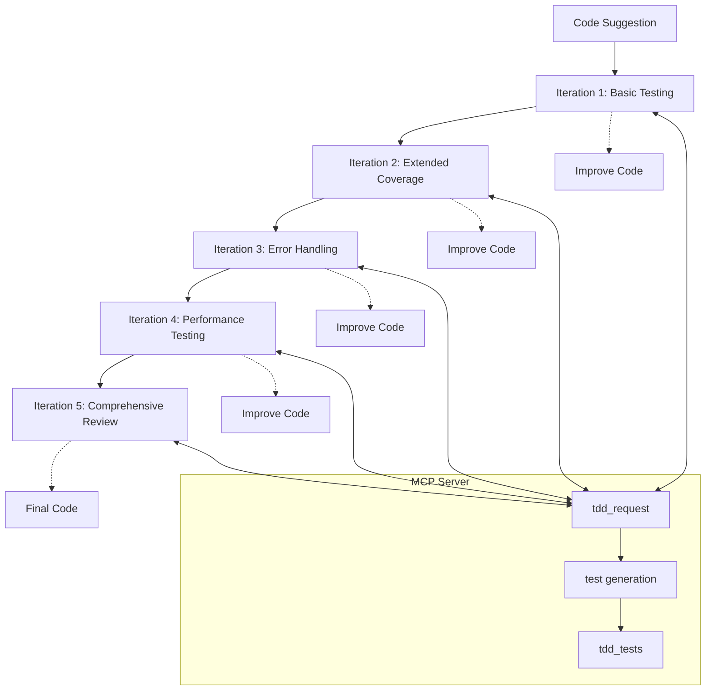

# Test-Driven Development (TDD) Flow

The AI Development Monitor now supports a comprehensive Test-Driven Development workflow that integrates with GitHub Copilot. This document explains the 5-iteration TDD cycle and how it improves code quality.

## GitHub Copilot Chat Integration

As of version 0.6.0, the AI Development Monitor can automatically run tests on code suggestions from GitHub Copilot Chat. This integration allows developers to:

1. Receive immediate feedback on the quality of Copilot Chat suggestions
2. View test execution results in the TDD Dashboard
3. Compare test results across different suggestions
4. Generate test templates automatically for Copilot suggestions

For detailed information about this feature, see [GitHub Copilot Test Execution](github_copilot_test_execution.md).

## TDD Cycle Overview



## Iteration Details

### Iteration 1: Basic Testing
- Tests for function existence and callability
- Verifies basic input/output with simple values
- Includes minimal edge cases
- Ensures the code aligns with task description

### Iteration 2: Extended Coverage
- Expands test coverage to normal use cases
- Tests with larger/more complex inputs
- Verifies correctness against known values
- Ensures implementation satisfies all requirements

### Iteration 3: Error Handling
- Tests behavior with invalid inputs
- Checks for proper exception handling
- Verifies boundary conditions are handled correctly
- Tests edge cases specific to task description

### Iteration 4: Performance Testing
- Tests with larger inputs that might cause issues
- Considers performance implications
- Suggests potential optimizations
- Verifies implementation efficiency

### Iteration 5: Comprehensive Review
- Summarizes overall test coverage
- Identifies any remaining gaps
- Suggests final code improvements
- Provides quality assessment
- Evaluates fulfillment of task description

## Code Evolution Examples

Throughout the TDD cycle, the code evolves from a basic implementation to a robust, optimized solution:

### Python Example (Factorial Function):

**Iteration 1: Basic Implementation**
```python
def factorial(n):
    if n <= 1:
        return 1
    return n * factorial(n-1)
```

**Iteration 2: Added Documentation**
```python
def factorial(n):
    """Calculate the factorial of a non-negative integer n."""
    if n <= 1:
        return 1
    return n * factorial(n-1)
```

**Iteration 3: Added Error Handling**
```python
def factorial(n):
    """Calculate the factorial of a non-negative integer n."""
    if n < 0:
        raise ValueError("Factorial is not defined for negative numbers")
    if n <= 1:
        return 1
    return n * factorial(n-1)
```

**Iteration 4: Iterative Implementation**
```python
def factorial(n: int) -> int:
    """
    Calculate the factorial of a non-negative integer.
    
    Args:
        n: A non-negative integer
        
    Returns:
        The factorial of n
        
    Raises:
        ValueError: If n is negative
    """
    if n < 0:
        raise ValueError("Factorial is not defined for negative numbers")
        
    result = 1
    for i in range(1, n + 1):
        result *= i
    return result
```

**Iteration 5: Optimized Implementation**
```python
from functools import lru_cache

@lru_cache(maxsize=None)
def factorial(n: int) -> int:
    """
    Calculate the factorial of a non-negative integer.
    Uses memoization for improved performance on repeated calls.
    
    Args:
        n: A non-negative integer
        
    Returns:
        The factorial of n
        
    Raises:
        ValueError: If n is negative
    """
    if n < 0:
        raise ValueError("Factorial is not defined for negative numbers")
        
    result = 1
    for i in range(1, n + 1):
        result *= i
    return result
```

## How It Works

1. The VS Code extension captures a GitHub Copilot suggestion
2. It sends the code to the MCP server as a suggestion message
3. The MCP server evaluates the suggestion and then initiates the TDD cycle
4. For each iteration, the server:
   - Sends a `tdd_request` message to the LLM
   - Generates appropriate tests based on iteration focus
   - Returns test code as a `tdd_tests` message
   - The extension creates temporary files to demonstrate code evolution
5. After 5 iterations, the TDD cycle is complete with optimized code and comprehensive tests

## Using the TDD Feature

The TDD functionality can be accessed through:

1. Running the diagnostic test which demonstrates the TDD cycle
2. Using the dedicated TDD commands provided by the extension (upcoming feature)

The web interface at http://localhost:5002 provides real-time monitoring of the entire TDD process, showing test generation, execution, and the evolving code implementation.
